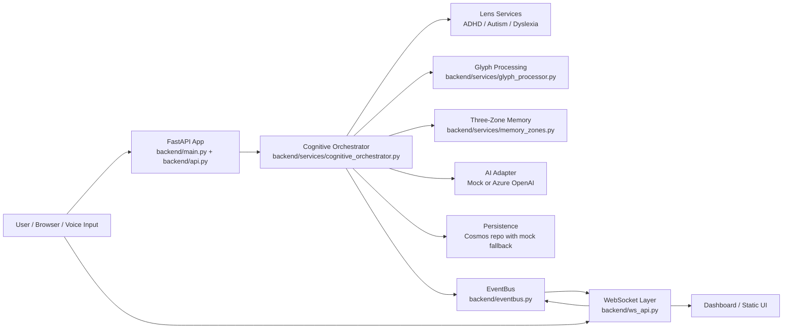

# C4 Container Model

## System Scope
Sentinel Forge is a FastAPI-based cognitive orchestration system with a browser-facing dashboard and optional Azure-backed AI and persistence integrations.

## Container Notes
- The primary runtime container is the FastAPI application.
- Event streaming is internal to the repo through the EventBus and WebSocket routes.
- AI and persistence both support local fallback paths for development and validation.
